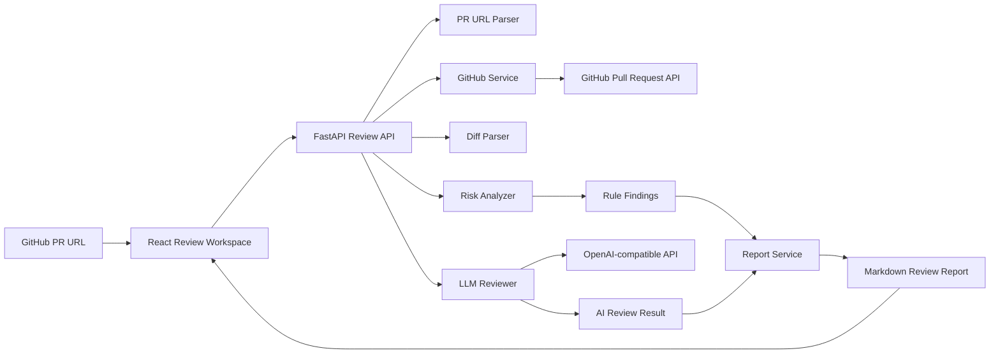

# CodeLens AI PR Review Assistant

<p align="center">
  <strong>让 GitHub Pull Request 审查更快、更稳、更像一位有经验的 reviewer。</strong>
</p>

<p align="center">
  
  
  
  
  
</p>

<p align="center">
  输入 GitHub PR 链接，自动获取 diff、识别高风险改动、生成结构化 Review 建议，并输出可直接复制的 Markdown 报告。
</p>

---

## Why CodeLens

CodeLens 不是一个“把 diff 扔给大模型问一句怎么看”的页面，而是一条完整的 PR Review 工作流：

- 自动获取 GitHub Pull Request 元数据、变更文件和 patch 内容
- 基于规则引擎识别高确定性风险，例如敏感信息、危险执行、SQL 拼接、测试缺失等
- 使用 AI Reviewer 结合关键上下文生成更像真实 reviewer 的总结与建议
- 最终输出结构化 Markdown Review 报告，直接服务真实协作流程

如果你正在做代码评审、团队 code review、PR 质量巡检，或者想把 AI 能力嵌入开发流程，CodeLens 的目标就是把这件事做得更可靠、更可解释，而不是更花哨。

## Product Preview

### Demo Video

> Demo 视频即将补充。录制脚本见 [docs/demo-script.md](./docs/demo-script.md)。

### Screenshots

当前仓库已预留展示位，建议最终 README 放入以下四张截图：

| Screen | Recommended Content |
| --- | --- |
| Home / Input Console | 首页输入区与产品首屏说明 |
| Review Overview | 审查结果 Hero、核心统计与风险概览 |
| Risk Table | 风险表格与筛选器 |
| Markdown Report | 可复制的最终报告输出 |

截图目录：[`screenshots/`](./screenshots/)

示例占位：

```markdown


```

## What It Does

### 1. GitHub PR Data Fetching

- 解析标准 GitHub PR URL
- 获取 PR 标题、作者、分支、状态、文件数、增删行数
- 拉取 changed files、patch、raw/blob 地址
- 支持传入 GitHub Token，缓解 API rate limit

### 2. Diff Parsing

- 解析 patch hunk、added lines、deleted lines
- 提取每个文件的关键变更片段
- 为规则引擎和 AI Reviewer 提供结构化上下文

### 3. Rule-Based Risk Detection

- 识别硬编码密钥、危险函数、异常吞掉、SQL 拼接、敏感日志输出
- 识别依赖变更、配置变更、权限敏感改动、CI / Deploy 敏感变更
- 识别大改动但测试不足的回归风险
- 输出 `severity` 与 `confidence`，让风险优先级更清晰

### 4. AI Reviewer

- 在 `use_ai=true` 时调用 OpenAI-compatible Chat Completions API
- 优先关注高风险文件、认证/配置/依赖敏感文件和关键 patch
- 生成 PR 总结、主要变更、风险研判和 reviewer 风格建议
- 在 AI 不可用时自动 fallback 到规则分析，保证主流程仍然可用

### 5. Markdown Review Report

- 汇总 PR 基本信息、风险详情、AI 结果和分析链路
- 生成可复制的 Markdown 审查报告
- 可直接用于 GitHub PR 评论区、团队复盘或审查归档

## Why It Is Different

### Rule Engine + AI Reviewer

CodeLens 的核心不是“大模型看代码”，而是双引擎协同：

- **Rule Engine**：负责高确定性风险发现，优先识别容易被忽略但代价高的问题
- **AI Reviewer**：负责理解变更影响面，组织 reviewer 风格表达，补充上下文级建议

这种组合的价值在于：

- 比单纯聊天问答更稳定
- 比只做 diff summarization 更可解释
- 比纯规则扫描更接近真实代码评审场景

### Not Just a Summary Tool

CodeLens 不只做“改了什么”的总结，还试图回答：

- 哪些改动值得优先复核
- 为什么这次变更存在潜在风险
- AI 的判断是基于哪些上下文得出的
- 哪些结论适合直接转成 PR review comment

## Architecture



完整数据流可以概括为：

`PR URL -> GitHub 数据获取 -> Diff 解析 -> 风险识别 -> AI 审查 -> Markdown 报告输出`

这让 CodeLens 更像一个完整产品，而不是单点 AI 功能。

## Example Output

- 审查报告示例：[`docs/review-example.md`](./docs/review-example.md)
- Demo 讲解脚本：[`docs/demo-script.md`](./docs/demo-script.md)

如果你想快速理解这个项目最终会输出什么，建议先看示例报告，它比单纯看界面更能说明产品价值。

## Quick Start

### Windows 一键启动

如果你在 Windows 本地开发、联调或录制 Demo，推荐直接使用根目录的 `start-dev.bat`：

```cmd
start-dev.bat
```

脚本会自动：

- 检查 `python` / `pip` / `node` / `npm`
- 复制 `backend/.env.example` 和 `frontend/.env.example`
- 安装前后端依赖
- 启动 FastAPI 后端与 Vite 前端
- 自动打开浏览器访问前端页面

默认地址：

- Frontend: `http://127.0.0.1:5173`
- Backend: `http://127.0.0.1:8000`

如果双击失败，脚本会保留窗口显示错误；也可以在 `cmd` 中运行查看完整输出。

### Manual Local Run

#### Backend

```bash
cd backend
pip install -r requirements.txt
uvicorn app.main:app --reload --host 0.0.0.0 --port 8000
```

推荐环境变量：

```env
GITHUB_TOKEN=
OPENAI_API_KEY=
OPENAI_BASE_URL=
OPENAI_MODEL=
LLM_TEMPERATURE=0.2
LLM_TIMEOUT=30
LLM_MAX_INPUT_CHARS=20000
```

#### Frontend

```bash
cd frontend
npm install
npm run dev
```

前端默认会通过 `frontend/.env` 中的 `VITE_API_BASE_URL` 访问后端。

## Tech Stack

### Frontend

- React
- Vite
- TypeScript

### Backend

- Python
- FastAPI
- Pydantic
- Requests

### External Services

- GitHub REST API
- OpenAI-compatible LLM API

## Limitations

- 未认证 GitHub API 请求容易触发 rate limit，建议传入 GitHub Token
- 超长 patch 会被截断，极大 PR 的上下文可能不完整
- AI 审查质量依赖所配置的模型能力与稳定性
- 当前规则库以高价值通用规则为主，尚未做语言/框架专项深度审查
- 当前版本主要聚焦本地运行与 Demo 展示，不包含 GitHub App 自动评论能力

## Roadmap

- [ ] GitHub App / 自动评论到 PR
- [ ] 团队级自定义规则与 review policy
- [ ] 面向不同语言/框架的专项规则包
- [ ] 历史 PR 审查记录沉淀与知识库化
- [ ] 更细粒度的 file-level / comment-level review suggestions

## Repository Structure

```text
backend/      FastAPI review service
frontend/     React review workspace
docs/         Demo script, example output, design notes
screenshots/  README preview assets
```

## Acknowledgements

CodeLens 诞生于一次高强度实战开发周期，但它的目标不是完成一道题，而是验证一条更贴近真实工程协作的 AI PR Review 产品路径。
