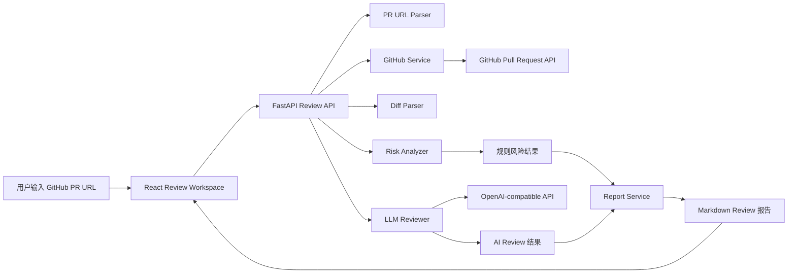

# CodeLens AI PR Review Assistant

CodeLens 是一个面向开发者的 AI Pull Request 代码评审助手，面向七牛云 × XEngineer 暑期实训营题目三“AI PR Review 助手”设计。用户输入 GitHub PR 链接后，系统会自动抓取 PR 元数据、变更文件和 patch 内容，结合规则引擎与 AI Reviewer 生成结构化代码审查结果，并输出可复制的 Markdown Review 报告。

仓库地址：<https://github.com/yftx293/qiniu-xengineer-ai-pr-review>

## 项目亮点

- 不是简单的大模型问答，而是完整的 `PR URL -> GitHub 数据获取 -> Diff 解析 -> 风险识别 -> AI 总结 -> Markdown 报告` 流程。
- 采用 `Rule Engine + AI Reviewer` 双引擎协同方案：规则负责识别高确定性风险，AI 负责总结影响面和生成 reviewer 风格建议。
- 输出结果可直接服务真实开发流程，支持复制 Markdown 报告用于 GitHub PR 评论区、团队内部复盘或演示展示。

## 对应赛题要求

本项目覆盖题目三的核心要求：

- 支持 PR 变更总结
- 支持风险代码识别
- 支持 Review 建议生成
- 说明模型选择
- 说明上下文获取方式
- 说明误报与漏报控制
- 说明未来扩展方向

## 核心能力

### 1. GitHub PR 数据获取

- 解析 `https://github.com/{owner}/{repo}/pull/{number}` 格式 PR 链接
- 获取 PR 标题、作者、状态、分支、变更文件数、增删行数
- 获取 changed files、patch、raw/blob 地址
- 支持传入 GitHub Token，缓解 GitHub API rate limit

### 2. Diff 解析与规则风险识别

- 解析 patch hunk、added lines、deleted lines
- 识别硬编码密钥、危险函数、异常吞掉、SQL 拼接、敏感日志输出、依赖变更、配置变更、权限敏感改动、CI/Deploy 敏感变更、测试缺失等风险
- 输出风险等级 `severity` 与置信度 `confidence`

### 3. AI Reviewer

- 在 `use_ai=true` 时调用 OpenAI-compatible Chat Completions API
- 优先基于高风险文件、认证/配置/依赖敏感文件和关键 patch 做上下文总结
- 生成 PR 总结、主要变更、风险分析和 reviewer 风格建议
- AI 配置缺失或调用失败时自动 fallback 到规则分析模式

### 4. Review 工作台

- 输入 GitHub PR URL
- 可选输入 GitHub Token
- 可选启用 AI Review
- 展示 PR 基本信息、风险概览、分析链路、风险详情、AI Review、Markdown 报告

## 创新点如何落地

### 1. 不是聊天回答，而是结构化审查流程

CodeLens 不是“把 diff 扔给大模型然后问一句怎么看”，而是将 PR 数据获取、Diff 解析、规则识别、AI 归纳和报告输出串成一个完整产品闭环。

### 2. 不是单一模型判断，而是规则与模型协作

- Rule Engine：负责高确定性风险识别，例如敏感信息、危险执行、权限敏感改动、测试缺失
- AI Reviewer：负责基于关键上下文组织 reviewer 风格总结，补充影响面分析和可执行建议

这种设计可以同时降低误报和漏报，也更容易让评委看见“产品方法论”。

### 3. 不是停留在页面展示，而是可落地 Markdown 输出

最终结果会生成一份结构化 Markdown Review 报告，适合复制到 GitHub PR 评论区或用于团队内部复盘，体现真实开发场景价值。

## 示例审查场景

- 安全风险型 PR：识别硬编码密钥、危险执行、敏感日志输出、SQL 拼接
- 权限敏感型 PR：识别 auth / permission / middleware 相关改动，提示重点做越权与失败路径测试
- 大改动缺少测试型 PR：识别高改动但无测试更新的情况，提示回归风险

## 系统架构



## 技术栈

### 前端

- React
- Vite
- TypeScript

### 后端

- Python
- FastAPI
- Pydantic
- Requests

### 外部服务

- GitHub REST API
- OpenAI-compatible LLM API

## 模型选择说明

当前项目采用 OpenAI-compatible Chat Completions API，原因如下：

- 接口通用，便于适配不同模型服务商
- 适合在短周期比赛中快速完成联调
- 能够结合规则结果与关键 patch 上下文输出结构化中文 Review

当前实现对模型能力的要求主要包括：

- 读取 PR 元数据与关键 patch 摘要
- 理解规则分析结果
- 输出固定 JSON 结构的总结与建议

## 上下文获取方式

系统通过 GitHub REST API 获取上下文，主要包括两类信息：

- `pulls/{pull_number}`：获取 PR 标题、作者、状态、分支、增删行数、变更文件数
- `pulls/{pull_number}/files`：获取 changed files、status、patch、raw/blob 地址

后端会进一步对 patch 做 Diff 解析，提取：

- hunk header
- added lines
- deleted lines
- 单文件新增/删除数量

为了控制上下文长度，系统会对超长 patch 做截断，并优先将高风险文件、认证/配置/依赖敏感文件和高改动文件送入 AI Reviewer。

## 误报与漏报控制

### 降低误报

- 将高确定性问题交给规则识别，例如硬编码密钥、危险函数、依赖变更、权限敏感改动
- 对规则加入误报抑制，例如忽略文档示例、测试假数据、日志中的敏感词
- 输出 `severity` 与 `confidence`，避免把所有提示都当作阻断项

### 降低漏报

- 规则覆盖安全、稳定性、配置、权限、测试等高频风险模式
- AI 在规则结果之外补充对整体改动影响面的理解
- 当 PR 变更较大但缺少测试时，单独提示回归风险

### 当前限制

- GitHub 未认证请求容易触发 rate limit
- 超长 patch 会被截断，极大 PR 的上下文可能不完整
- AI Review 质量依赖用户配置的模型能力
- 当前规则库以高价值通用规则为主，尚未做语言/框架级深度专项检查

## 本地运行

### 1. 启动后端

```bash
cd backend
pip install -r requirements.txt
uvicorn app.main:app --reload --host 0.0.0.0 --port 8000
```

可选 `.env` 配置：

```env
OPENAI_API_KEY=
OPENAI_BASE_URL=
OPENAI_MODEL=
LLM_TEMPERATURE=0.2
LLM_TIMEOUT=30
LLM_MAX_INPUT_CHARS=20000
```

### 2. 启动前端

```bash
cd frontend
npm install
npm run dev
```

默认访问地址：

- 前端：`http://127.0.0.1:5173`
- 后端：`http://127.0.0.1:8000`

## 使用流程

1. 启动前后端服务
2. 打开前端页面
3. 输入 GitHub PR URL
4. 可选填写 GitHub Token
5. 可选勾选 AI Review
6. 点击“开始分析”
7. 查看 PR 信息、风险结果、AI 建议和 Markdown 报告
8. 复制 Markdown 报告用于分享或粘贴回 GitHub PR

## Demo 与截图

### Demo 视频

- 待补充：录制完成后更新公开可访问的视频链接

### 页面截图

- 截图目录：`screenshots/`
- 建议保留以下画面：
  - 输入表单页
  - 分析结果总览页
  - 风险表格页
  - Markdown 报告页

### README 截图占位

```markdown


```

### Demo 脚本

- 录制讲解脚本见：`docs/demo-script.md`
- 建议控制在 2 到 3 分钟内，优先讲清“问题背景、分析链路、风险识别、AI 建议、Markdown 报告输出”

## 评分点映射

### 作品完整度与创新性

- 具备从 PR 链接到最终报告输出的完整链路
- 规则引擎与 AI Reviewer 双引擎协同，有明确创新表达
- 页面展示不仅给结果，还解释“为什么得到这个结果”

### 开发过程与质量

- 使用多分支与 PR 持续开发
- 主分支保持可运行
- 后端测试、构建与编译检查可通过

### 演示与表达

- README 包含项目简介、能力说明、技术方案与创新表达
- 页面适合录屏展示，首屏和结果页都能快速传达价值
- 输出 Markdown 报告，便于展示最终产物

## 未来扩展方向

- 输出逐条 review comment 草稿，而不只是全局报告
- 支持团队自定义规则配置
- 增加语言/框架专项规则
- 支持 GitHub App、Webhook 或 CI 自动触发
- 支持历史 PR 复盘与团队知识沉淀
