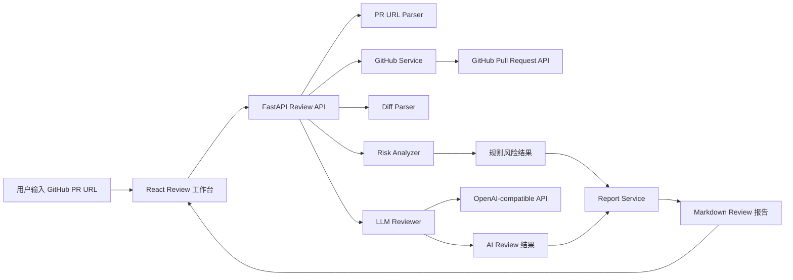

# CodeLens AI PR Review Assistant

CodeLens 是一个面向开发者的 AI Pull Request 代码评审助手，面向七牛云 × XEngineer 暑期实训营题目三“AI PR Review 助手”设计。用户输入 GitHub Pull Request 链接后，系统会自动抓取 PR 元数据、变更文件和 patch 内容，结合规则引擎与 AI 模型输出结构化 Review 结论，并生成可复制的 Markdown 报告。

仓库地址：<https://github.com/yftx293/qiniu-xengineer-ai-pr-review>

## 项目亮点

- 不是简单的大模型问答，而是完整的 PR Review 工作流：PR 链接解析、GitHub 数据获取、Diff 解析、规则识别、AI 总结、Markdown 报告输出。
- 采用“规则分析 + AI 生成”的混合策略：规则负责识别高确定性风险，AI 负责总结上下文和组织自然语言建议。
- 输出结果可直接服务真实开发场景，支持复制为 Markdown Review 报告，便于贴回 GitHub PR 评论区或团队协作文档。

## 对应赛题要求

本项目覆盖题目三的核心要求：

- 支持 PR 变更总结
- 支持风险代码识别
- 支持 Review 建议生成
- 说明模型选择
- 说明上下文获取方式
- 说明误报与漏报控制
- 说明未来扩展方向

## 核心功能

### 1. GitHub PR 数据获取

- 解析 `https://github.com/{owner}/{repo}/pull/{number}` 格式的 PR 链接
- 获取 PR 标题、作者、分支、状态、变更文件数、增删行数
- 获取 changed files、patch、raw/blob 地址
- 支持用户传入 GitHub Token，缓解 GitHub API rate limit

### 2. Diff 解析与规则风险识别

- 解析 patch hunk、added lines、deleted lines
- 识别硬编码密钥、危险函数、异常吞掉、潜在 SQL 注入、依赖变更、配置变更、权限敏感改动、缺失测试等风险
- 输出风险等级 `severity` 与置信度 `confidence`

### 3. AI Review 生成

- 在 `use_ai=true` 时调用 OpenAI-compatible Chat Completions API
- 生成 PR 总结、主要变更、风险分析和 Review 建议
- AI 配置缺失或调用失败时自动 fallback 到规则模式

### 4. 前端 Review 工作台

- 输入 GitHub PR URL
- 可选输入 GitHub Token
- 可选启用 AI Review
- 展示 PR 基本信息、变更统计、风险概览、风险详情、AI Review、Markdown 报告

## 系统架构



## 技术栈

### 前端

- React
- Vite
- TypeScript

### 后端

- Python
- FastAPI
- Pydantic
- Requests

### 外部服务

- GitHub REST API
- OpenAI-compatible LLM API

## 目录结构

```text
qiniu-xengineer-ai-pr-review/
├─ README.md
├─ docs/
│  ├─ design.md
│  └─ pr-plan.md
├─ backend/
│  ├─ README.md
│  ├─ requirements.txt
│  └─ app/
├─ frontend/
│  ├─ README.md
│  ├─ package.json
│  └─ src/
└─ screenshots/
```

## 模型选择说明

当前项目采用 OpenAI-compatible Chat Completions API，原因如下：

- 接口通用，便于适配不同模型服务商
- 适合在短周期比赛中快速完成联调
- 能够结合规则结果和 patch 上下文输出结构化中文 Review

当前实现对模型能力的要求主要包括：

- 读取 PR 元数据与 patch 摘要
- 理解规则分析结果
- 输出固定 JSON 结构的总结与建议

## 上下文获取方式

系统通过 GitHub REST API 获取上下文，主要包括两类信息：

- `pulls/{pull_number}`：获取 PR 标题、作者、状态、分支、增删行数、变更文件数
- `pulls/{pull_number}/files`：获取 changed files、status、patch、raw/blob 地址

后端会进一步对 patch 做 Diff 解析，提取：

- hunk header
- added lines
- deleted lines
- 单文件新增/删除数量

为控制上下文长度，系统会对超长 patch 做截断，并在规则分析和 AI 输入中仅保留必要信息。

## 误报与漏报控制

本项目使用“规则分析 + AI 总结”的混合方案，分别控制误报与漏报：

### 降低误报

- 将高确定性问题交给规则识别，例如硬编码密钥、危险函数、依赖文件变更
- 对结果输出 `severity` 与 `confidence`，避免把所有问题都当作阻断项
- AI 仅基于真实的 PR 信息、文件变更和规则输出生成总结，不允许编造文件或风险

### 降低漏报

- 规则覆盖安全、稳定性、依赖、配置、测试缺失等高频风险模式
- AI 在规则结果之外补充对整体改动意图和主要影响面的理解
- 当 PR 改动较大但未包含测试文件时，单独提示回归风险

### 当前限制

- GitHub 未认证请求容易触发 rate limit
- 超长 patch 会被截断，极大 PR 的上下文可能不完整
- AI Review 质量依赖用户配置的模型能力
- 当前规则库仍以高价值通用规则为主，暂未做语言/框架专属深度检查

## 本地运行

### 1. 启动后端

```bash
cd backend
pip install -r requirements.txt
uvicorn app.main:app --reload --host 0.0.0.0 --port 8000
```

可选 `.env` 配置：

```env
OPENAI_API_KEY=
OPENAI_BASE_URL=
OPENAI_MODEL=
LLM_TEMPERATURE=0.2
LLM_TIMEOUT=30
LLM_MAX_INPUT_CHARS=20000
```

### 2. 启动前端

```bash
cd frontend
npm install
npm run dev
```

前端默认访问：

- 前端：`http://127.0.0.1:5173`
- 后端：`http://127.0.0.1:8000`

## 使用流程

1. 启动前后端服务
2. 打开前端页面
3. 输入 GitHub PR URL
4. 可选填写 GitHub Token
5. 可选勾选 AI Review
6. 点击“开始分析”
7. 查看 PR 信息、风险结果、AI 建议和 Markdown 报告
8. 复制 Markdown 报告用于二次分享或贴回 PR

## Demo 与截图

### Demo 视频

- 待补充：将在最终录制完成后更新公开可访问的视频链接

#### Demo 录制前检查清单

- 前后端服务均可正常启动
- 准备一个可稳定分析的公开 GitHub PR 链接
- 准备一组不启用 AI 的演示流程
- 准备一组启用 AI 的演示流程
- 确认 Markdown 报告复制按钮可正常使用
- 确认 README 中的仓库地址、视频地址和截图说明完整

### 页面截图

- 截图目录：`screenshots/`
- 当前建议保留以下演示画面：
  - 输入表单页
  - 成功分析结果页
  - 风险表格与 AI Review 展示页
  - Markdown 报告复制效果页

## 最终提交前检查清单

- 公开仓库链接可正常访问，且主分支代码可运行
- README 已包含项目简介、运行方式、技术方案、模型说明和未来扩展方向
- README 已预留 Demo 视频链接位置，并可在录制完成后直接替换
- `screenshots/` 目录中的截图素材已整理完毕，可直接用于 README 或答辩展示
- 演示流程已覆盖 PR 输入、规则分析、AI Review、Markdown 报告复制
- 提交记录与 PR 节奏符合比赛要求，避免只有最后一天集中提交

## 开发过程与 PR 留痕

项目采用“小步提交、持续交付、按功能拆分 PR”的方式开发，当前已完成的主线包括：

- PR 2：初始化后端服务
- PR 3：获取 GitHub PR 元数据与文件信息
- PR 4：实现 Diff 解析与规则风险分析
- PR 5：集成 AI Review 生成
- PR 6：构建前端 Review 工作台

后续冲刺会继续拆分文档、测试、可解释性和前端展示优化，保留 merge commit，确保评委可以直接从 GitHub 历史中看到持续开发过程。

## 未来扩展方向

- 支持 GitHub App 模式，自动回写 PR 评论
- 支持团队自定义规则库和风险策略
- 支持更多语言与框架的专用静态检查
- 支持历史 Review 记录与团队知识沉淀
- 支持接入 CI/CD，在 PR 阶段自动触发分析

## 安全说明

- GitHub Token 仅用于本次请求，不保存到 localStorage、sessionStorage 或 cookie
- 不要把任何真实 Token 或 API Key 提交到仓库
- AI Review 只作为辅助建议，最终合并决策仍需人工确认

## 相关文档

- 后端说明：`backend/README.md`
- 前端说明：`frontend/README.md`
- 设计说明：`docs/design.md`
- PR 开发计划：`docs/pr-plan.md`
